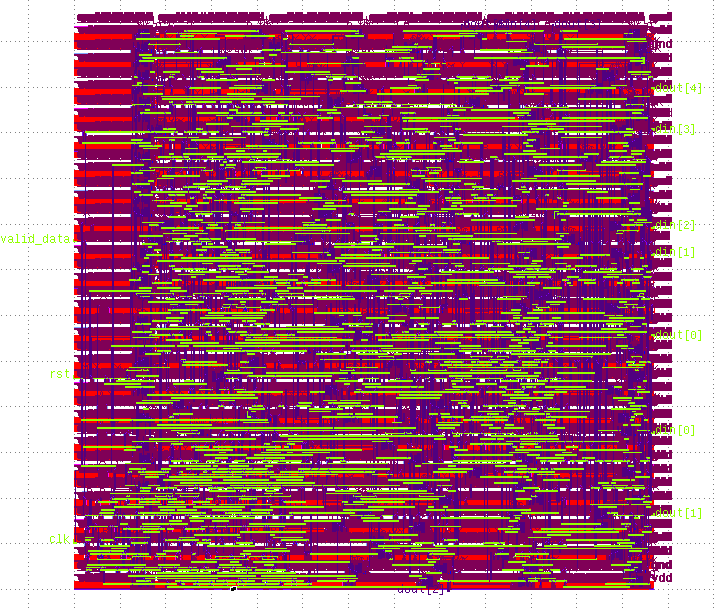

# Open source VLSI Software Installation

## Unix commands

```
sudo apt-get install vim 	# install vim
ls 				# list computer files
ls -l 				# use a long listing format
mkdir rtl			# make a directory named "example"
cd rtl				# move inside of "example" dir
cd ..				# go back to up folder
pwd				# current working directory
touch rtl/counter.v 		# Create a counter.v empty file inside rtl folder
cp rtl/counter.v rtl/sum.v 	# Create a copy of counter.v named sum.v
cp rtl/sum.v rtl/ddf.v    	# Create a copy of sum.v named dff.v
mv rtl/dff.v rtl/reg.v      	# Move dff.v to reg.v (change name)
find ./ -iname '*.v'		# Find all files with .v extension
rm ./rtl/ddf.v 			# Remove ddf.v file
rm -fr ./rtl/*			# Remove all files inside ./rtl folder
rm -fr ./rtl			# Remove .rtl/ folder
sudo 				# Add before any command to execute as administrator.
sudo su 			# Login as administrator
sudo username			# Login as username
csh test.csh			# Execute test.csh
wget http://www.asic-world.com/code/hdl_models/up_counter.v 	#Download a file from web
vim up_counter.v 		# Load up_counter.v with VIM Editor

### Advanced UNIX commands
ln -s /path/to/dir /path/to/symlink  # Symbolic link to a folder. Useful to create source folder for Qflow


```
## Basic VIM commands
```
i 				#Enter to INSERT Mode where you can type like any normal editor
ESC				#Go back to Command Mode

#In command mode
:w 				# Write file
:q 				# Safe exit. If exist any change won't exit.
:q!				# Force exit
:wq!  				# Write and exit
dd 				# Delete line
D 				# Delete everything after the cursor
gg 				# Go to the top of the file
G 				# Go to the bottom of the file
/counter    			# Search in the file for "counter"
n 				# Go to the next word found.
:%s/reset/rst/e 		# Replace "reset" word with "rst"
CTRL + v 			# Enter to visual mode

#In visual mode

# Write the same text in multiple lines
				# Move down with the cursor
Shift + i 			# Enter to insert mode
ESC				# End command

```
## Ubuntu Packages

```
sudo apt-get install \
vim \
gtkwave \
make \
cmake \
git \
gcc \
m4 \
autoconf \
gperf \
readline-common \
build-essential \
clang \
bison \
flex \
libreadline-dev \
libffi-dev \
gawk \
tcl-dev \
libffi-dev \
mercurial \
graphviz \
xdot \
pkg-config \
python3 \
libboost-python-dev \
libboost-system-dev \
libboost-filesystem-dev \
libx11-dev \
csh \
libgsl-dev \
tcl-dev \
tk-dev \
tcsh \
sudo apt-get install python3-tk \
libncurses-dev \
libcairo2-dev
```

## Git configuration

```
git config --global user.name "Your Name Goes Here"   
git config --global user.email "you@yourpublicemail.example.com
```

## Softwares


### QtSpim
```
sudo apt-get install qt4-dev-tools qt4-doc libqt4-help
wget https://sourceforge.net/projects/spimsimulator/files/qtspim_9.1.20_linux64.deb
sudo dpkg -i qtspim_9.1.20_linux64.deb
rm -fr qtspim_9.1.20_linux64.deb
```
### iverilog 
```
git clone https://github.com/steveicarus/iverilog
cd iverilog
git checkout --track -b v10-branch origin/v10-branch
git pull
sh autoconf.sh
./configure
make
sudo make install
cd ..
rm -fr /iverilog
```

### Yosys

```
git clone https://github.com/cliffordwolf/yosys
cd yosys
make config-gcc
make
make test
sudo make install
cd ..
rm -fr yosys
```

### graywolf
```
git clone https://github.com/rubund/graywolf.git
cd graywolf
cmake .
make
sudo make install
cd ..
rm -fr graywolf
```

### Qrouter

```
wget http://opencircuitdesign.com/qrouter/archive/qrouter-1.4.49.tgz
tar zxvf qrouter-1.4.49.tgz
cd qrouter-1.4.49/
./configure
make
sudo make install
cd ..
rm -fr qrouter-1.4.49/
```

### Netgen

```
wget http://opencircuitdesign.com/netgen/archive/netgen-1.5.118.tgz
tar zxvf netgen-1.5.118.tgz
cd netgen-1.5.118
./configure
make
sudo make install
cd ..
rm -fr  netgen-1.5.118
```
###  Magic

```
wget http://opencircuitdesign.com/magic/archive/magic-8.2.110.tgz
tar zxvf magic-8.2.110.tgz
cd magic-8.2.110
./configure
make
sudo make install
cd ..
rm -fr magic-8.2.110
```


###  OpenTimer

```
git clone https://github.com/OpenTimer/OpenTimer.git
cd OpenTimer
mkdir build
cd build
cmake ../
make 
sudo make install
cd ../../
rm -fr OpenTimer

```
###  OpenSTA
```
git clone https://github.com/The-OpenROAD-Project/OpenSTA.git
cd OpenSTA
mkdir build
cd build
cmake ..
make
sudo make install
cd ..
rm -fr OpenSTA
```

### Qflow
```
wget http://opencircuitdesign.com/qflow/archive/qflow-1.3.13.tgz
tar zxvf qflow-1.3.13.tgz
cd qflow-1.3.13
./configure
make
sudo make install
cd ..
rm -fr qflow-1.3.13
```

### OpenRAM 
```
sudo apt install python3-numpy
sudo apt install python3-scipy
sudo apt install ngspice
sudo apt-get install build-essential linux-headers-`uname -r`
sudo apt-get install libtool automake autoconf
sudo apt-get install flex bison texinfo
sudo apt-get install libx11-dev libxaw7-dev

git clone https://github.com/VLSIDA/OpenRAM.git

echo 'export OPENRAM_HOME="$HOME/openRAM/compiler"' >> ~/.bash_profile
echo 'export OPENRAM_TECH="$HOME/openRAM/technology"' >> ~/.bash_profile
echo 'export PYTHONPATH="$PYTHONPATH:$OPENRAM_HOME' >> ~/.bash_profile
```

### Check installed programs
```
ls /usr/local/bin/
```

### Download examples for each programs

```
git clone https://github.com/jdvenega/openvlsi.git

```

# Write GDS -  Magic

```
cd project/qflow/layout
cp ~/openvlsi/examples/magic/run_drc_fir2n.tcl ./

magic -dnull -noconsole ./run_drc_fir2n.tcl 
```

I recommend Klayout to take picture of the GDS file
```
cd project/qflow/layout

klayout fir2n.gds
```

<p align="center">
  
</p>
